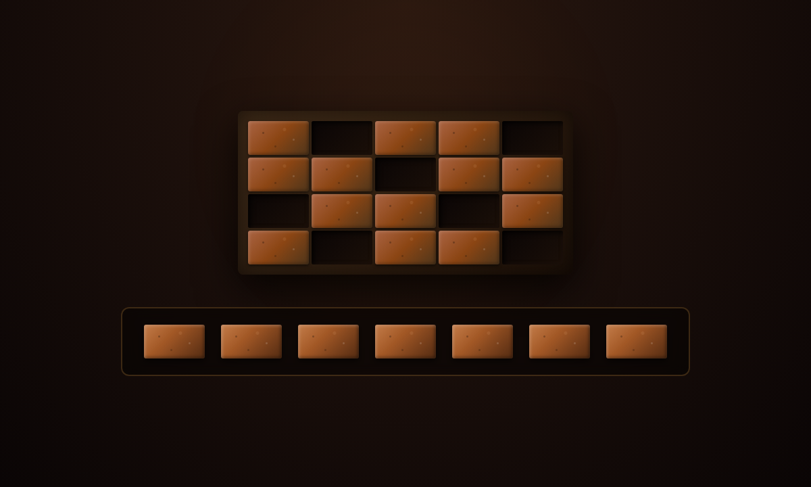
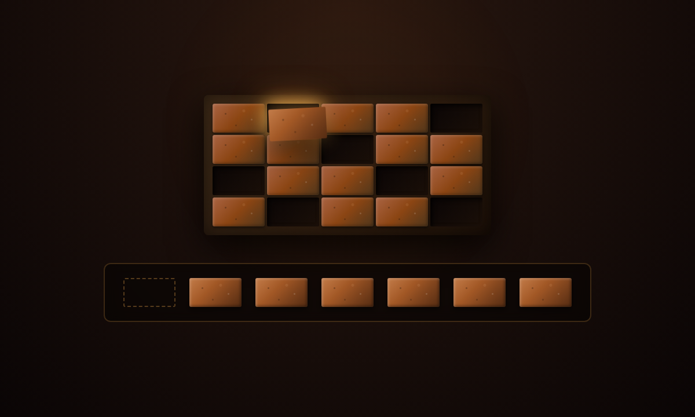
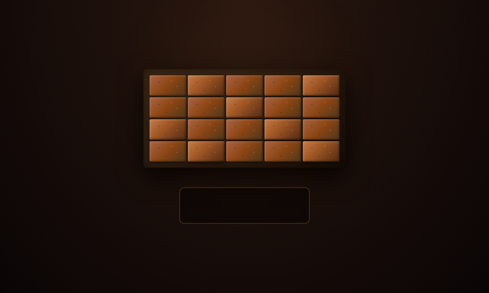

# Drag & Drop Brick Wall


A small brick wall puzzle. Drag bricks from the tray into the gaps, or move any brick around the wall. Fill every gap and the wall shakes with a burst of dust.

## How to play

- **Drop on an empty gap:** the brick fills it.
- **Drop on another brick:** the two bricks swap places.
- **Drop on the tray:** the brick comes off the wall.
- **Drop anywhere else, or press Esc:** the brick goes back where it came from.

Works with mouse, touch and pen (Pointer Events).

## Screenshots

| Start | Dragging | Complete |
|---|---|---|
|  |  |  |

## Customize

Settings are at the top of `script.js`:

- `wallLayout`: the wall grid (`1` = brick, `0` = gap). If you change the number of columns or rows, update `grid-template-columns` and `grid-template-rows` on `.wall` in `style.css` to match.
- `SNAP_RADIUS`: how close (in px) a brick must be to a gap to snap in.
- `LOCK_ORIGINAL_BRICKS`: set to `true` to keep the starting bricks fixed.

## Run

Open `index.html` in a browser. No build step or dependencies.

## Files

```
Brick-Wall-Drag-Drop/
├── index.html
├── style.css
├── script.js
├── preview.png
└── screenshots/
```
